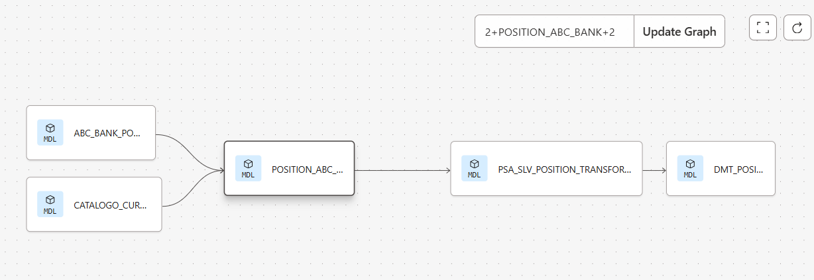

# 📊 Seguimiento de Operaciones de Trading con dbt + Snowflake

Bienvenido al proyecto de data engineering y analytics que permite administrar, transformar y analizar operaciones de trading en un entorno moderno de datos.
Este repositorio está diseñado para aprovechar dbt como framework de transformación de datos y Snowflake como data warehouse escalable y seguro.

## Que hace esta proyecto?

- Carga de datos de operaciones integrando información de fuentes (archivo Json, archivo csv).

- Modelado con dbt: transforma datos crudos en modelos analíticos listos para usar (staging, refined y DMT).

- Integración con Snowflake: permite escalar el procesamiento y analizar millones de registros de forma rápida y confiable.

## Ejemplo de Resultados 📷

- Vista en dbt docs (lineage de modelos y dependencias).

## 🎯 Características principales

- Modelado modular con dbt: staging, mart y análisis de operaciones.

- Optimización en Snowflake: uso de clustering y vistas materializadas.

- Auditoría y calidad de datos: tests de dbt para validar integridad, duplicados y reglas de negocio.

- Versionado y CI/CD: integración con GitHub Actions para despliegue automático.

- Escalabilidad: diseñado para crecer desde cientos hasta millones de operaciones.

## 🛠 Tecnologías Utilizadas

- **dbt Core**
- **Snowflake**
- **SQL**

## 🛠 Configuraciones iniciales

Para garantizar una conexion estable entre snowflake y DBT, se realizaron las siguientes actividades.

- Crear base de datos con la cuenta default de snowflake.

- crear un nuevo role y asignarlo a un nuevo usuario.

- Crear schemas y stage (para este proceso se utiliza un stage de snwoflake).

- Otorgar los privilegios necesarios al usuario para la base de datos, shcemas y stage.

la configuracion se encuentra en el siguiente código.

[Pre_configuration_snowflake]

### 🧠 Inspiración

Este proyecto nace como una solución del Bootcamp Data Engineer de Z2H Academy, con la idea de:

- Estandarizar el flujo de datos de operaciones.

- Dar trazabilidad a cada trade.

- Crear una arquitectura moderna, que se pueda escalar facilmente.

## Licencia

Este proyecto está bajo la Licencia MIT. Consulta el archivo [LICENSE](LICENSE) para más detalles.

