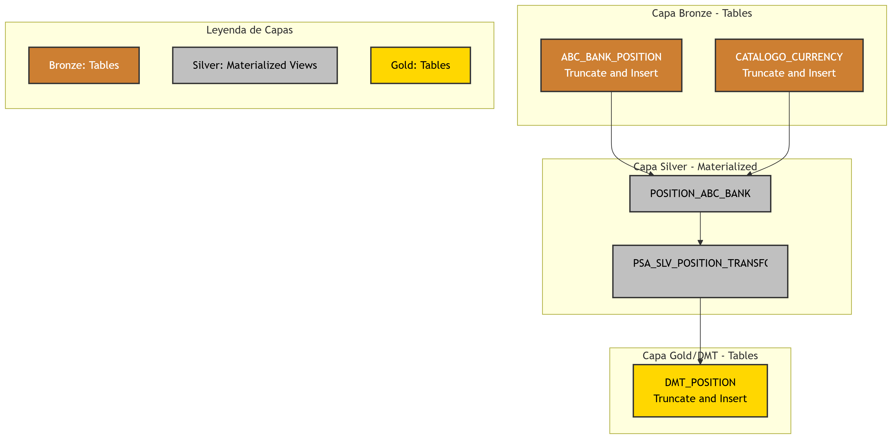

# 📊 Tracking Portfolio dbt + Snowflake

This project enables the administration, transformation and analysis of tracking portfolio in a modern data environment.

It leverages DBT as the transformation framework and Snowflake as scalable and secure data warehouse, following the medallion architecture (Bronze, Silver, Gold).

## What does this project do?

- Data loading: ingests trading operation data from files JSON y CSV.

- Data transformation with DBT: Converts raw data into ready-to-use analytical models.

Bronze (STG_SOURCE): performs truncate and insert operations to maintain an exact copy of the raw data with full traceability.

Silver (Refined): cleans and transforms data into materialized views to optimize performance, validate quality and standarize data.

Gold (Mart/DMT): recalculates and aggregates data into final models used for reports.

- Integration with Snowflake: scales processing and analysis quickly and reliably.

## Example results 📷

- DBT docs view (lineage and model dependencies).

- Architecture overview

## 🎯  Key features

- **Modular Modeling with DBT**: staging, refined and mart layers.

- **Performance optimization in Snowflake**: materialized view.

- **Data quality & audit**: DBT tests to ensure accuracy.

- **Version control and CI/CD**: GIT HUB actions for automated deployment.

- **Scalability**: designed to growth from thousands to millions of operations.

## 🛠 Tools used

- **DBT Core**
- **Snowflake**
- **SQL**

## 🛠 Initial setup

To establish a stable connection between Snowflake and DBT, the following steps are required:

1. Create a database under default Snowflake user.

2. Create a new role and user, and assign the role to the user.

3. CreatEing schemas and stage (Snowflake stage).

4. Grant the neccesary privilegies to the role over database, schemas ans stage.

For more details, see [Pre-Configuration Snowflake](Pre_configuration_Snowflake.md)

## 🛠 Medallion architecture Bronze, silver and Gold

Detail of each layer.

- **Bronze** (STG_SOURCE) [Bronze](models/STG_SOURCE/README.md)

- **Silver** (Refined) [Silver](models/refined/README.md)

- **Gold** (Marts) [Gold](models/marts/README.md)

### 🧠 Inspiration

This project was created as part of the Data Engineering Bootcamp by Z2H Academy, with the following goals:

- Standarize a workflow.

- Ensure full traceability of every operation.

- Build a modern, easily scalable architecture.

## License

This project is licensed under the MIT License. See the [LICENSE](LICENSE) file for datails.

